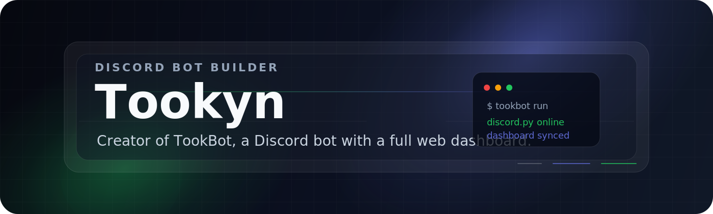

  

<h1 align="center">Tookyn</h1>

  <strong>Createur de TookBot</strong>, un bot Discord multi-fonctions avec dashboard web, systemes communautaires et outils d'administration.

  
  
  
  

---

<h3 align="center">A propos</h3>

  Je construis surtout autour de <strong>TookBot</strong>, mon bot Discord principal. 
  Le projet combine un bot communautaire, un dashboard Flask, une base SQLite, des modules CS2, musique, moderation, tickets, giveaways, XP, battle pass et alertes sociales.

  Mon objectif : faire un bot utile au quotidien, simple a piloter depuis Discord comme depuis le web, avec une vraie attention portee a l'experience admin.

<table align="center">
  <tr>
    <td width="50%">
      <h3>TookBot en bref</h3>
      <ul>
        <li>Bot Discord en Python avec discord.py</li>
        <li>Dashboard web Flask + Jinja</li>
        <li>Base SQLite pour la persistance</li>
        <li>Architecture bot + web separes sous PM2</li>
      </ul>
    </td>
    <td width="50%">
      <h3>Modules principaux</h3>
      <ul>
        <li>XP, niveaux, leaderboard et battle pass</li>
        <li>Musique YouTube, files d'attente et vocal</li>
        <li>Tickets, reaction roles et moderation</li>
        <li>CS2 : stats, inventaire, prix skins, Faceit et queues</li>
      </ul>
    </td>
  </tr>
</table>

<h3 align="center">Stack</h3>

  

  
  
  
  

<h3 align="center">Projet principal</h3>

<table align="center">
  <tr>
    <td width="55%">
      <h3>TookBot</h3>
      
Bot Discord personnel multi-feature avec dashboard admin integre. Il gere l'activite serveur, les commandes slash, les profils, la moderation, la musique, les tickets, les giveaways et des modules CS2 avances.

      

        
      

    </td>
    <td width="45%">
      <h3>Dashboard web</h3>
      
Interface sombre pour piloter les serveurs, inspecter la base, modifier les reglages et envoyer des actions au bot via une file de commandes DB-backed.

      
<strong>Bot + web</strong> tournent comme deux processus separes.

    </td>
  </tr>
</table>

<h3 align="center">Fonctionnalites</h3>

<table align="center">
  <tr>
    <td width="33%">
      <h3>Communaute</h3>
      
XP, niveaux, leaderboard, welcome builder, auto-reactions, reaction roles, tickets et giveaways persistants.

    </td>
    <td width="33%">
      <h3>Gaming</h3>
      
Module CS2 avec liaison Steam/Faceit, stats joueur, inventaire, prix de skins, rank roles, queue Premier et map ban.

    </td>
    <td width="33%">
      <h3>Admin</h3>
      
Moderation, warns, notes privees, logs, commandes custom, alertes Twitch/YouTube/Reddit et dashboard de gestion.

    </td>
  </tr>
</table>

<h3 align="center">TookBot snapshot</h3>

<table align="center">
  <tr>
    <td align="center" width="25%">
      <strong>69+</strong> 
      commandes slash
    </td>
    <td align="center" width="25%">
      <strong>16</strong> 
      modules bot
    </td>
    <td align="center" width="25%">
      <strong>32</strong> 
      pages & templates web
    </td>
    <td align="center" width="25%">
      <strong>2</strong> 
      processus PM2
    </td>
  </tr>
</table>

  

<h3 align="center">Me contacter</h3>

  

  Design sobre, lisible et maintenable. Derniere mise a jour : 2026.

